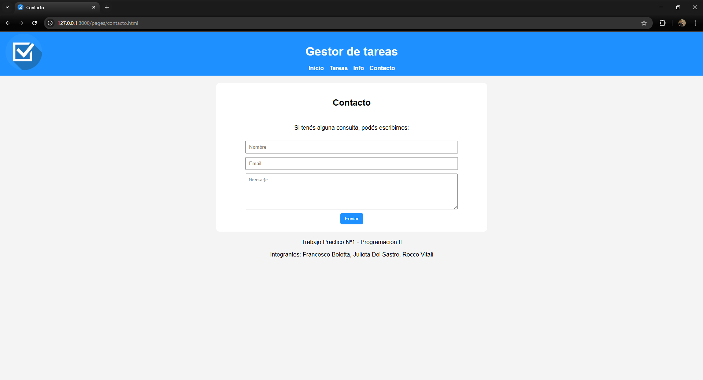
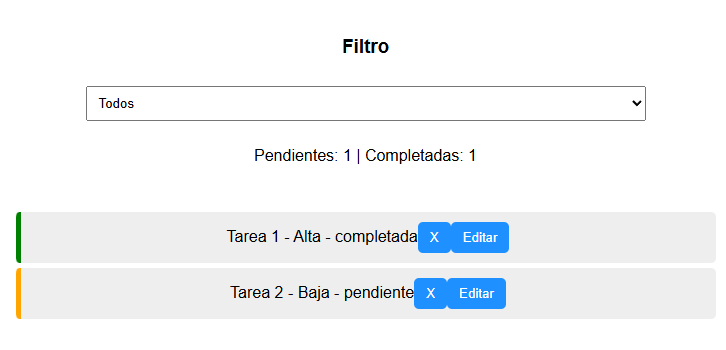
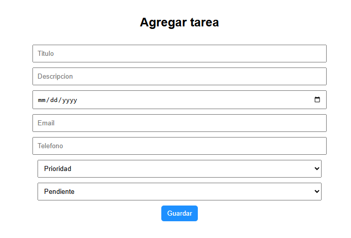
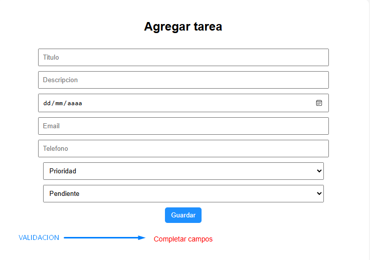

# Gestor de tareas (To-Do List) 

## Integrantes

- Francesco Boletta  
- Julieta Del Sastre  
- Rocco Vitali  

---

## Objetivo del proyecto

El objetivo de este trabajo práctico es aplicar conceptos de HTML, CSS y JavaScript, incluyendo manipulación del DOM, almacenamiento local y diseño responsive.

## Descripción
Esta aplicación web permite gestionar tareas de manera sencilla.  
El usuario puede crear, editar y eliminar tareas, además de organizarlas según su estado y prioridad.

---

## Funcionalidades

- Agregar nuevas tareas  
- Editar tareas existentes  
- Eliminar tareas  
- Filtrar por estado (pendiente / completada)  
- Ordenar tareas por fecha  
- Contador de tareas pendientes y completadas  
- Validación de formulario en tiempo real  

---

## Tecnologías utilizadas

- HTML  
- CSS  
- JavaScript  
- localStorage  
- Visual Studio Code
- Discord  
- GitHub  

---

## Diseño Responsive

El sitio se adapta a diferentes dispositivos:

- Desktop  
- Tablet  
- Celular  

---

## Interfaz y experiencia de usuario

- Navegación entre páginas  
- Feedback visual en formularios  
- Transiciones y efectos hover  
- Icono favicon personalizado  

---

## 📷 Capturas

### Inicio

### Lista de tareas

### Formulario

### Validación

---

## Cómo ejecutar el proyecto

1. Descargar desde el repositorio  
2. Abrir el archivo `index.html` en el navegador  

---

